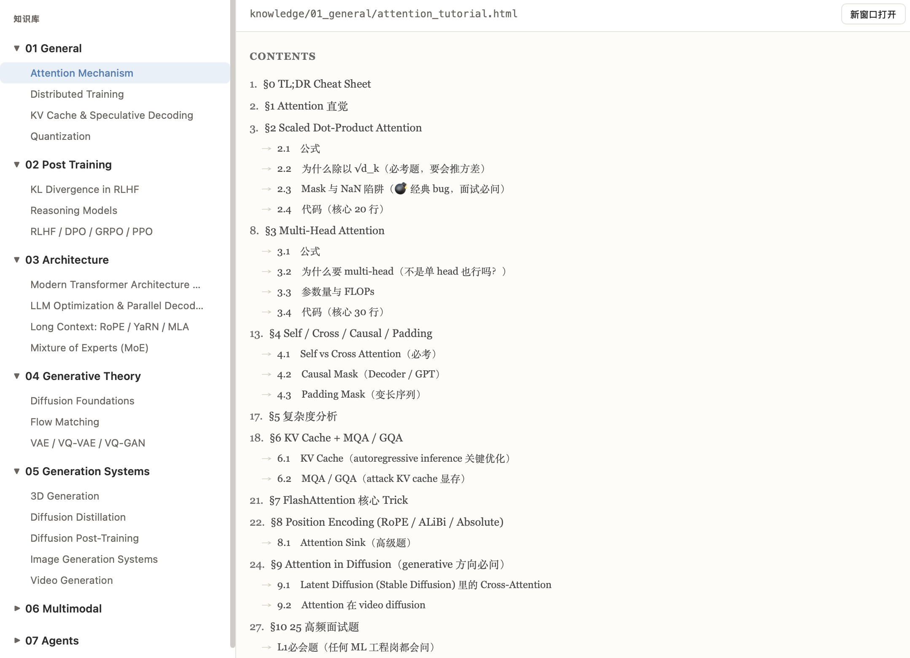
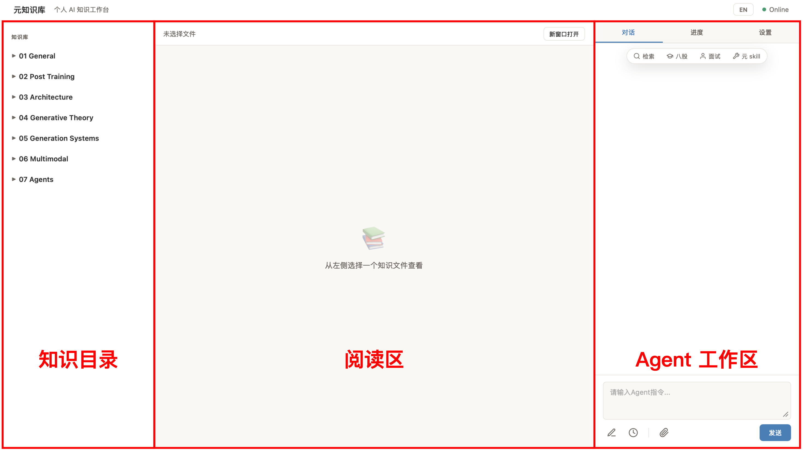
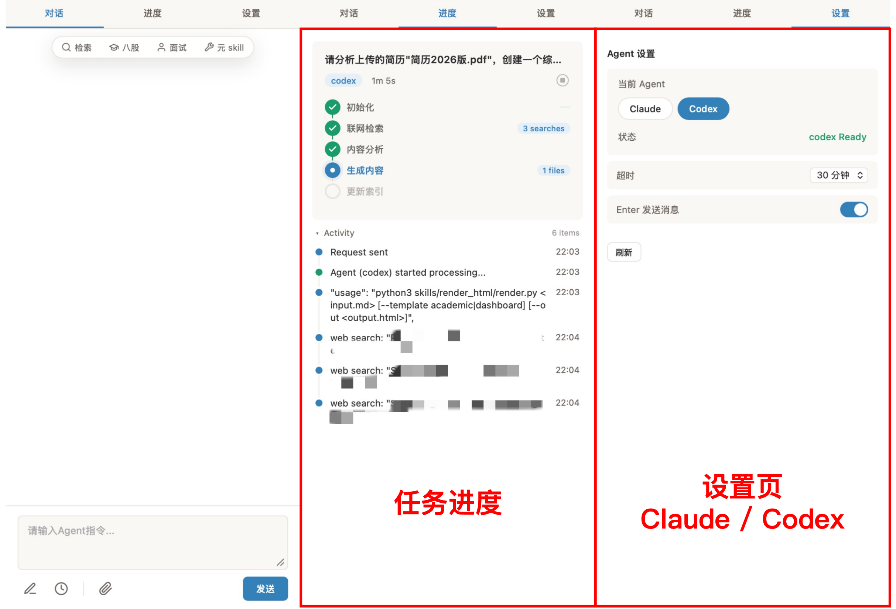
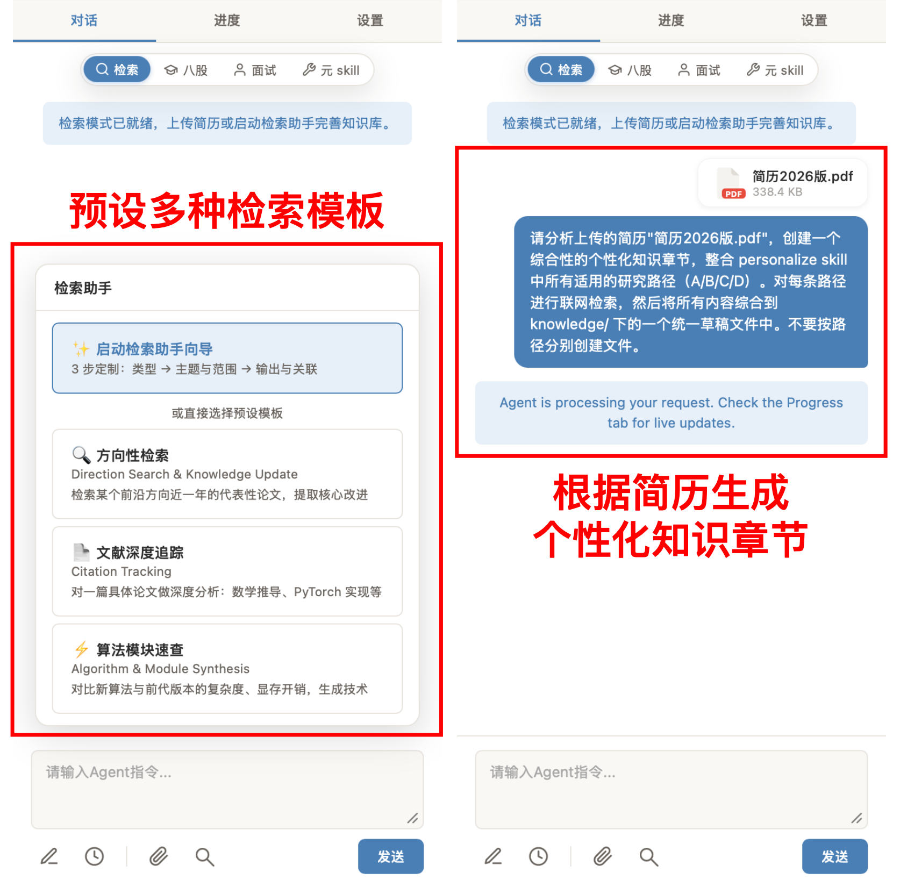
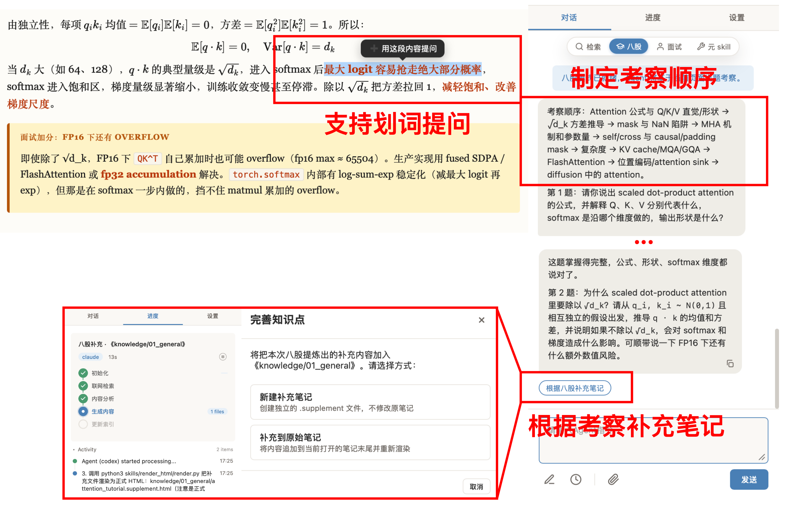
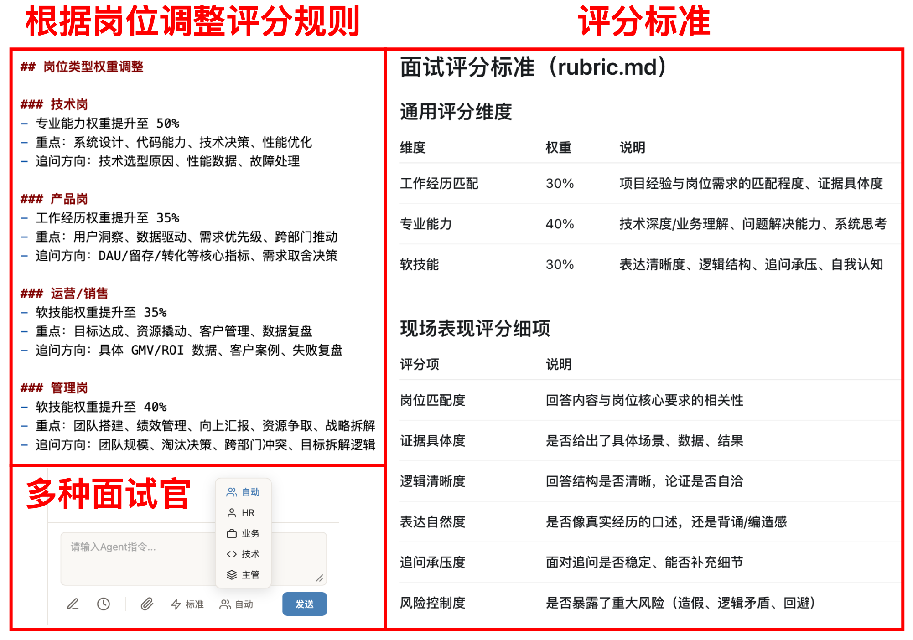
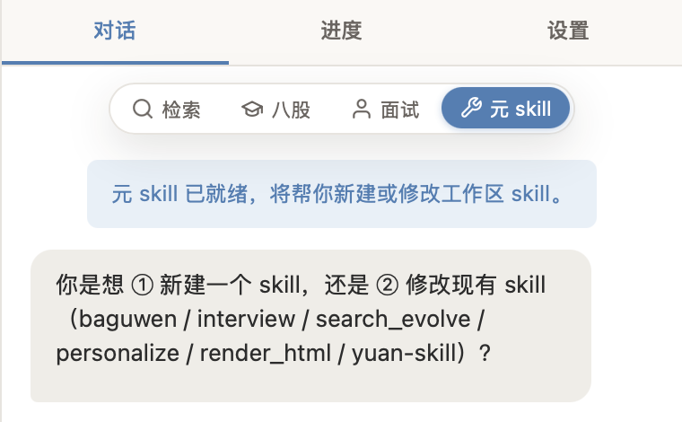

# 元知识库

一个可以检索资料、背八股、模拟面试的个性化知识工作台。

## 项目简介

**元知识库** 旨在打造一个真正属于自己的个性化知识库，把分散在各处的信息系统地汇总起来；并在学习、提问、复盘和模拟面试的过程中，逐步内化为自己的知识和能力。

---

## 冷启动知识库

冷启动内容继承自 ARIS-in-AI-Offer：

项目按照方向分类，整理了 AI 面试和学习中的常见知识点，包括原理、公式推导和代码。

主要包含以下方向：

- AI 通用基础
- 后训练与对齐
- 模型架构
- 生成理论
- 生成系统
- 多模态
- Agent

---

## 页面布局

元知识库前端采用三栏布局：

### 1. 左侧：知识目录

已有文章、后续检索生成的新内容，都会放在这里，方便统一管理和查找。

### 2. 中间：阅读区

知识章节以 `html + md` 的形式存储：

- `html` 用于人类阅读
- `md` 用于 Agent 理解和处理

### 3. 右侧：Agent 工作区

可以直接与 Agent 对话，也可以切换不同模式：

- 检索
- 八股
- 面试
- 元 skill

每个模式对应一个或多个 skills 组合，用来完成不同的学习和复盘任务。

---

## 任务进度与设置

右侧还单独做了任务进度页和设置页。

对于一些执行时间较长的任务，可以在任务进度页观察当前执行状态。

设置页支持在不同 Agent 后端之间切换。

## 主要功能

## 1. 检索：把新资料补进自己的知识库

工作台内置了多种检索模板，可以辅助你进行联网检索、资料整理和知识生成。

除了普通检索，也可以上传 PDF 简历，生成贴合你个人背景的知识章节。

---

## 2. 八股：基于知识章节进行多轮追问

点击“八股”，Agent 就会根据当前页面内容制定考察顺序，逐轮提问。

提问暴露出来的问题可以整理成新的知识条目，方便下次回顾。

## 3. 面试：基于简历和岗位需求模拟面试

上传简历，贴上目标岗位 JD，就可以开始模拟面试。

支持切换不同类型的面试官，有不同的考察重点，并且会根据岗位类型调整评分规则。

## 4. 元 skill：修改已有 skill 或创建新 skill

元 skill 用来修改已有 skill，或者创建一个新的 skill。

会通过几轮提问（功能继承自“十万个为什么“maxkura/Ask_Why），把你的需求理清楚，让工作台生长出更适合你自己的使用方式。
